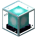

<div align="center">
  
  <h1>Beacon</h1>
  <p><strong>A focused progress tracker for Minecraft speedruns.</strong></p>
  <p>
    <a href="https://github.com/liaozhangsheng/beacon/actions/workflows/ci.yml"></a>
    <a href="LICENSE"></a>
  </p>
  <p><a href="#beacon">English</a> · <a href="README_zh.md">中文</a></p>
</div>

Beacon reads Minecraft save data and turns advancements, statistics, and custom rules into a live speedrun checklist. It provides a main window, an optional overlay, bundled templates, and a small template system for runs that do not fit the defaults.

## Highlights

- **Live progress tracking** — discovers worlds and players, then refreshes the active save while you play.
- **Advancements and statistics** — reads the standard `stats/<uuid>.json` and `advancements/<uuid>.json` files without modifying the save.
- **Main window and overlay** — use the full tracker or a compact, configurable overlay during a run.
- **Version-aware templates** — the bundled templates are selected by Minecraft `DataVersion`.
- **Resilient refresh** — keeps the last successful state visible when a file is temporarily unavailable or still being written.
- **Customizable runs** — define goals, rules, languages, layouts, and icons in a template package.
- **Cross-platform desktop app** — designed for Windows, macOS, and Linux.

## For users

### Getting started

1. Build or download Beacon for your platform.
2. Launch `beacon`.
3. Open settings and choose your Minecraft game directory and template.
4. Select a world and player, then start playing. Beacon updates the checklist as the save changes.

The default Minecraft directories are detected automatically:

| Platform | Default game directory |
| --- | --- |
| Windows | `%APPDATA%/.minecraft` |
| macOS | `~/Library/Application Support/minecraft` |
| Linux | `~/.minecraft` |

The bundled templates currently include:

| Template | Purpose |
| --- | --- |
| `1.16` | Minecraft 1.16 speedrun advancements |
| `26.1` | Minecraft 26.1 speedrun advancements |
| `26.2` | Minecraft 26.2 speedrun advancements |
| `26.3` | Minecraft 26.3 speedrun advancements |
| `all_potions` | A version-independent all-potions checklist |

### Data and recovery behavior

Beacon only reads the selected Minecraft save. Settings and avatar cache are stored in the platform-specific application data directory, under `config/settings.json` and `cache/avatars/`.

The active world is checked frequently; other worlds are scanned periodically for changes. If Minecraft is still writing a file, Beacon keeps the last valid progress, reports the stale data state, and retries. A damaged or inaccessible unrelated world is reported without stopping the active tracker.

## For developers

### Requirements

- A C++20 compiler
- CMake 3.21 or newer
- Git with submodule support
- vcpkg

SDL3, SDL3_image, OpenSSL, and the optional Catch2 test dependency are declared in [`vcpkg.json`](vcpkg.json). The desktop application uses SDL3 and OpenSSL; the core libraries can be built without them.

### Build from source

Clone the repository with its submodules, then configure it with vcpkg manifest mode:

```sh
git clone --recurse-submodules https://github.com/liaozhangsheng/beacon.git
cd beacon

cmake -S . -B build -G Ninja \
  -DCMAKE_BUILD_TYPE=Release \
  -DCMAKE_TOOLCHAIN_FILE="$VCPKG_ROOT/scripts/buildsystems/vcpkg.cmake"
cmake --build build --parallel
```

Run the application:

```sh
./build/beacon
```

On Windows, run `build/beacon.exe` instead. If the submodules were cloned without `--recurse-submodules`, initialize them manually:

```sh
git submodule update --init --recursive
```

To build only the non-desktop libraries:

```sh
cmake -S . -B build-core -G Ninja \
  -DCMAKE_BUILD_TYPE=Release \
  -DBEACON_BUILD_DESKTOP=OFF
cmake --build build-core --parallel
```

### Tests and formatting

Configure with the test feature enabled, build, and run the regression suite:

```sh
cmake -S . -B build -G Ninja \
  -DCMAKE_BUILD_TYPE=Debug \
  -DBUILD_TESTING=ON \
  -DCMAKE_TOOLCHAIN_FILE="$VCPKG_ROOT/scripts/buildsystems/vcpkg.cmake"
cmake --build build --parallel
ctest --test-dir build --output-on-failure
```

On Linux, formatting can be checked with:

```sh
cmake --build build --target format-check
```

The continuous integration workflow covers Linux, Windows, and macOS: [`.github/workflows/ci.yml`](.github/workflows/ci.yml).

### Project layout

| Path | Responsibility |
| --- | --- |
| `src/core` | Template compilation, rule evaluation, and shared data models |
| `src/io` | Safe filesystem and file-change handling |
| `src/minecraft` | Save discovery plus stats and advancement parsing |
| `src/app` | Runtime refresh, persistence, and manual progress |
| `src/ui` | Presentation, layout, rendering, and desktop interaction |
| `templates` | Bundled template packages |
| `assets` | Fonts, UI assets, and Minecraft icons |
| `test` | Core, filesystem, presentation, UI, and package checks |

### Custom templates

Templates are self-contained directories under `templates/`. Each template must contain:

```text
templates/<name>/
├── template.json   # goals, facts, rules, and Minecraft compatibility
├── lang.json       # localized text
└── layout.json     # main-window and overlay layout
```

Use the bundled [`beacon-custom-template` skill](.agents/skills/beacon-custom-template/SKILL.md) for the complete schema, validation rules, and examples. A template may reference icons from the bundled asset directory or include its own language and image resources.

## Minecraft resources and trademarks

The icons under [`assets/vender/minecraft/`](assets/vender/minecraft/) are derived from the **vanilla Minecraft Java Edition 26.1 resource assets**. They are bundled only to identify goals in Beacon's unofficial progress tracker; they are not a replacement for the Minecraft game or its resource pack.

Minecraft is a trademark of Microsoft Corporation. Beacon is an independent, unofficial project and is not affiliated with, endorsed by, or sponsored by Mojang Studios or Microsoft.

## License

Beacon is released under the [MIT License](LICENSE). Third-party components and resources retain their own licenses and notices, including [GNU Unifont's SIL Open Font License](assets/fonts/Unifont-LICENSE.txt).
